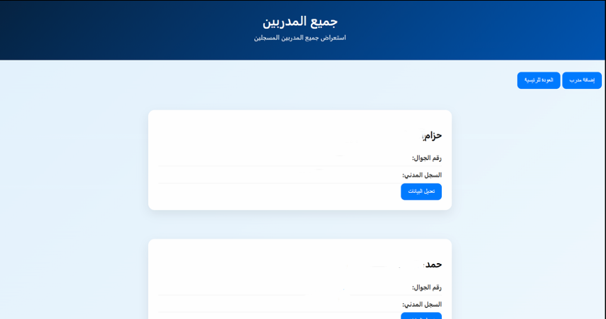

# Trainer Management System

<p align="center">
  
</p>

A web-based trainer management system developed during cooperative training to organize, search, view, add, and update trainer information using PHP and MySQL.

---

# About the Project

The **Trainer Management System** was developed as part of my cooperative training to organize trainer information and make it easier to search, retrieve, and update records.

The project started with a simpler data-based approach and was later developed into a dynamic web application connected to a **MySQL database**, with **PHP** used for database operations and data processing.

The final system allows users to search for trainers using different criteria, add new trainer records, view all trainers, and update existing information.

---

# Project Information

- **Project Type:** Cooperative Training Project
- **Development:** Web Application
- **My Role:** Software Development
- **Year:** 2026

---

# Features

- Search for trainers by:
  - Trainer ID
  - National ID
  - Phone number
  - Name
- Add new trainer records.
- View all trainer records.
- Update existing trainer information.
- Retrieve trainer data from a MySQL database.
- Display trainer information dynamically.
- Display additional trainer details.
- Access training certificate links.
- Support Arabic RTL interface.
- Responsive layout for different screen sizes.

---

# Technologies Used

## Backend

- PHP
- MySQL
- MySQLi

## Frontend

- HTML5
- CSS3
- JavaScript

## Database

- MySQL

---

# My Contribution

This project was developed as part of my cooperative training.

### My Responsibilities

- Developed the web application.
- Implemented the trainer search functionality.
- Developed the trainer data management pages.
- Connected the application to the MySQL database.
- Implemented SQL queries for retrieving, inserting, and updating trainer records.
- Developed the frontend using HTML, CSS, and JavaScript.
- Implemented dynamic data retrieval between JavaScript and PHP.
- Tested and improved the system during development.

---

# Database Integration

The final version of the system uses a **MySQL database** to store and retrieve trainer information.

The application uses PHP to communicate with the database and execute SQL queries.

For example, trainer records can be inserted into the `trainers` table, retrieved using search queries, and updated when required.

The JavaScript search interface communicates with `search.php`, which retrieves matching records from the database and returns the results as JSON.

---

# Screenshots

## Home Page


---

## Add New Trainer


---

## Trainer Records



---

## Edit Trainer


---

# How It Works

1. The user enters a trainer ID, national ID, phone number, or name.
2. JavaScript sends the search request to the PHP backend.
3. PHP executes a query against the MySQL database.
4. Matching trainer records are returned as JSON.
5. JavaScript displays the retrieved information in the interface.
6. Users can also add new trainers or update existing records.

---

# Project Structure

```text
trainer-management-system/
│
├── add_trainer.php
├── all_trainers.php
├── db.example.php
├── edit_trainer.php
├── index.html
├── search.php
├── script.js
├── style.css
└── README.md
```

---

# Database Configuration

The project requires a MySQL database to run the dynamic PHP functionality.

For security reasons, the original database connection credentials are not included in this public repository.

A `db.example.php` file is provided as a configuration template.

To run the project locally:

1. Create a MySQL database.
2. Create the required `trainers` table.
3. Configure the database credentials in `db.php`.
4. Place the project in a PHP-compatible local server environment.
5. Open the application through the local server.

> The original database and private connection credentials are intentionally not included in this repository.

---

# Deployment

The project was previously deployed using **InfinityFree** during the cooperative training period.

The application was uploaded to a live hosting environment and connected to a MySQL database to operate as a dynamic web application.

---

# Privacy

The original project involved trainer information containing personal and professional data.

For this public GitHub repository, private database credentials and sensitive information have been excluded.

The repository contains only the application source code and a safe database configuration example.

---

# Future Improvements

- Add user authentication and access permissions.
- Add delete functionality.
- Improve database validation and security.
- Improve search and filtering options.
- Add trainer statistics and reports.
- Add PDF and Excel export functionality.
- Improve the user interface and interactions.
- Deploy the system using a production-ready hosting environment.

---

# Developer

**Nada Baker Aljohani**

Web Developer

Digital College of Technology for Girls – Jeddah

Graduation Year: 2026
